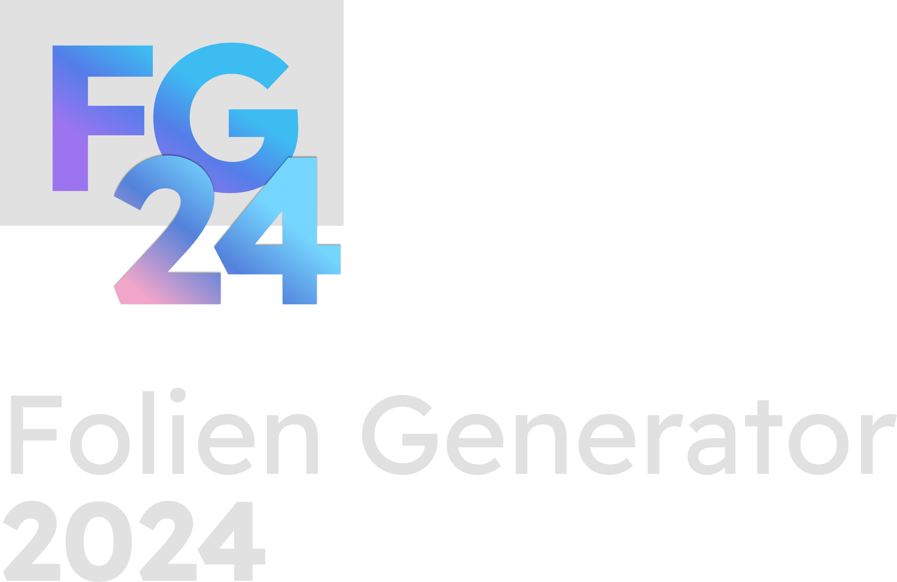

    

---

This repository holds the source code to the Folien Generator 24 Project, used by the Department of Electrical Engineering and Information Technology (etit) to generate slideshows for their bi-annual graduation ceremony.

## Table of Contents
- [Introduction](#introduction)
- [Features](#features)
- [Usage](#usage)
- [Installation](#installation)
- [Contributors](#contributors)
- [License](#license)

## Introduction

The goal of FG24 is to deduce out of three Excel lists of students that hold different information, which of those students will be participating at that graduation ceremony. For each one of those students, FG24 will generate a slide.

## Features

- FG24 reads three *etit* internal lists to deduce which students will participate in the graduation ceremony
- An XLSX file called the "Control File" is generated, where for each read student, regardless of their participation, a row is generated holding all the recognized information for that student.
- This XLSX file can be manually manipulated.
- The XLSX file can at any point be fed to FG24 together with an *etit* internal PowerPoint Presentation Template file, in order to generate Slides for every student marked with a "JA" in a certain column of the Control File.
- The Log File allows the user to quickly glance over every step the program took. It also provides easy Debugging, if the user ever comes across any issues.
- The properties file allows the user to manually determine which columns hold which information in which list. This allows FG24 to be used even if the formats of the lists change.

## Usage
Using FG24 is pretty straightforward.
- Upon opening FG24, you'll get a file selection screen. This is where you choose where you want the Log to be saved in.
- Initially, in the "Kontrolldatei" Tab, select the input files, select the output location and select the semester you want the students to be filtered after, and press "Kontrolldatei generieren!". This Control File can be manipulated and edited afterwards.
- Once you're ready for slides to be generated, open the second tab (named "Folien"), select the Control File from which the slides should be generated, the PowerPoint Template and lastly the output file. Click "Folien erzeugen" and let it rip!
- To change the expected formatting of the input files, you can generate a Properties File by going to the menu bar, opening the "Properties-Datei" Menu, clicking "Default Properties-Datei Exportieren..." and selecting where you want it to be saved. The values in this file can be adapted accordingly, and the file can be reimported by clicking "Properties-Datei Importieren" in the same Menu.
- To change the path of the Log file, under the "Protokolldatei" Menu, click "Protokolldatei Speicherort Ändern".

## Installation

In order to get FG24 up and running, Java 17 is required. Maven2 is required for compiling it.
- Clone the git repository using `git clone https://git.rwth-aachen.de/fg24/source.git`
- Open the main directory that was created. There, execute `mvn package`. This will run the package script which will generate a JAR file and an EXE wrapper for the program.
- Once the script is done running, under the `target` directory, you may find `FG24.exe`.
- Run and use!

## Contributors

Project was  written by Amar Ademi, Bayrem Agrebi, Hai Bui Quang, Duc Thai Tran and Omar Shoukry as part of the Bachelor Praktikum Module, B.Sc. Informatik degree at TU Darmstadt.

Since this project was a university project, it is no longer maintained by them!

## License

This project is licensed under the MIT license.